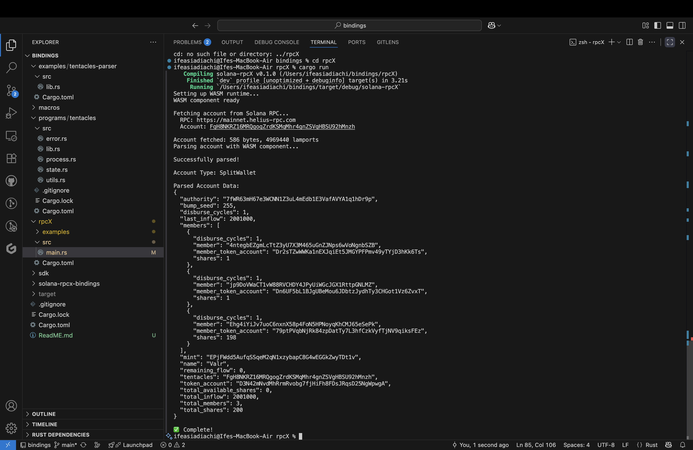

# Solana RPCX

A complete Rust toolkit for building and running rpcX packages that enable custom parsing of Solana on-chain data. This project includes an SDK for building parsers, a runtime for executing WASM components, and all necessary bindings to transform raw account bytes into human-readable JSON responses.

## What is rpcX?

rpcX is a feature of Atlas(Elipsis Labs) that eliminates the need for client-side deserialization code when reading SVM data. Instead of fetching raw bytes from RPC nodes, rpcX packages enable RPC methods to return parsed JSON objects directly.

## Features

- Framework-agnostic: Works with Anchor, native Solana programs, and custom frameworks
- Multiple serialization formats: Supports Borsh, Bincode, and custom formats
- Flexible discriminator strategies: Handle different account type identification approaches
- Type-safe builder pattern: Easy registration of account and instruction parsers
- Compiles to WASM components for use with rpcX enabled clients

## Project Structure

```
.
├── sdk/                          # Core SDK for building parsers
├── rpcX/                         # Runtime for executing WASM components
├── solana-rpcx-bindings/         # WIT bindings for WASM interface
├── examples/tentacles-parser/    # Example parser implementation
└── macros/                       # Procedural macros (future)
```

## Quick Start

### 1. Add the SDK as a dependency

```toml
[dependencies]
solana-rpcx-sdk = { path = "path/to/sdk", features = ["anchor"] }
```

### 2. Create your parser

```rust
use solana_rpcx_sdk::prelude::*;
use once_cell::sync::Lazy;

// Define your conversion function
fn account_to_json(account: &MyAccount) -> Result<String, String> {
    let json = serde_json::json!({
        "field1": account.field1.to_string(),
        "field2": account.field2,
    });
    serde_json::to_string(&json).map_err(|e| e.to_string())
}

// Register your parser
static PARSER: Lazy<Parser> = Lazy::new(|| {
    ParserBuilder::new("YourProgramID")
        .register_anchor_account::<MyAccount, _>(account_to_json)
        .with_metadata(ProgramMetadata {
            name: Some("My Program".to_string()),
            program_id: Some("YourProgramID".to_string()),
            project_url: Some("https://github.com/you/project".to_string()),
            version: Some("1.0.0".to_string()),
        })
        .build()
});

// Implement the guest trait
struct Component;

impl ProgramParserGuest for Component {
    fn parse_account(account: SolanaAccount) -> Result<ParsedAccount, ParseError> {
        PARSER.parse_account(&account)
    }
    
    // ... implement other required methods
}

solana_rpcx_sdk::bindings::export!(Component with_types_in solana_rpcx_sdk::bindings);
```

### 3. Configure for WASM output

```toml
[lib]
crate-type = ["cdylib"]
```

### 4. Build your parser

```bash
cargo component build --release
```

## Example: Parsing Anchor Accounts

See the `examples/tentacles-parser` directory for a complete example that:

- Registers an Anchor account type (SplitWallet)
- Converts account data to JSON
- Implements all required guest traits
- Compiles to a WASM component

## Running the Example

```bash
# Build the example parser
cd examples/tentacles-parser
cargo component build --release

# Run the runtime to test parsing
cd ../../rpcX
ACCOUNT_ADDRESS=<address> RPC_URL=<rpc-url> cargo run
```

## Demo


## Supported Account Types

The SDK supports multiple registration methods:

- `register_anchor_account<T>()` - Anchor accounts with 8-byte discriminators
- `register_borsh_account<T>()` - Native Borsh accounts without discriminators
- `register_account_with_discriminator<T>()` - Custom discriminator length
- `register_custom_account()` - Fully custom parsing logic

## Supported Instruction Types

- `register_anchor_instruction<T>()` - Anchor instructions
- `register_borsh_instruction<T>()` - Native Borsh instructions
- `register_custom_instruction()` - Custom instruction parsing

## Documentation

For more information about rpcX:
- [Jarry Xiao Tweet](https://x.com/jarxiao/status/1887924059578495433)
- [rpcX](https://docs.atlas.xyz/rpc/rpcx)

## Project: Kilimanjaro
This implementation of rpcX is part of project Kilimajaro

Kilimanjaro is a suite of tools aimed at revitalizing the read layer on Solana. Other public projects include:

- [Osoh](https://github.com/Ozodimgba/osoh)
- [ChainSmoker](https://github.com/Ozodimgba/chainsmoker)